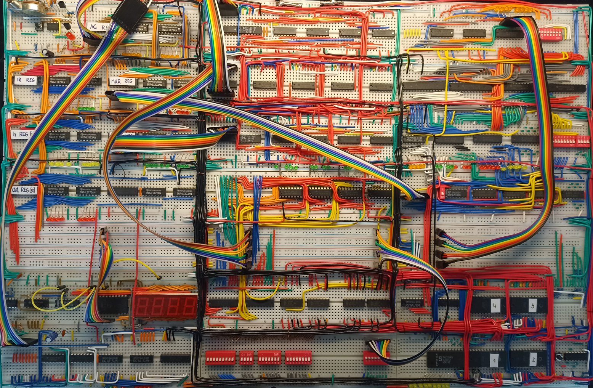

# NAT-1: 8bit computer

> ⚠️ **Warning**: This project is currently under development, was not verified yet and may not be fully functional. Stay tuned for updates!

## Overview
NAT-1 (also known as NATALIE-1) is an 8-bit computer based on the well-known **MARIE architecture**.
This simple computer is described in `The Essentials of Computer Organization and Architecture`,
a book written by Linda Null and Julia Lobur. The project was developed for educational purposes.

    

        
    

# Documentation
List of available documents:
- [Hardware Architecture Spec](doc/hw-arch-spec.md)
