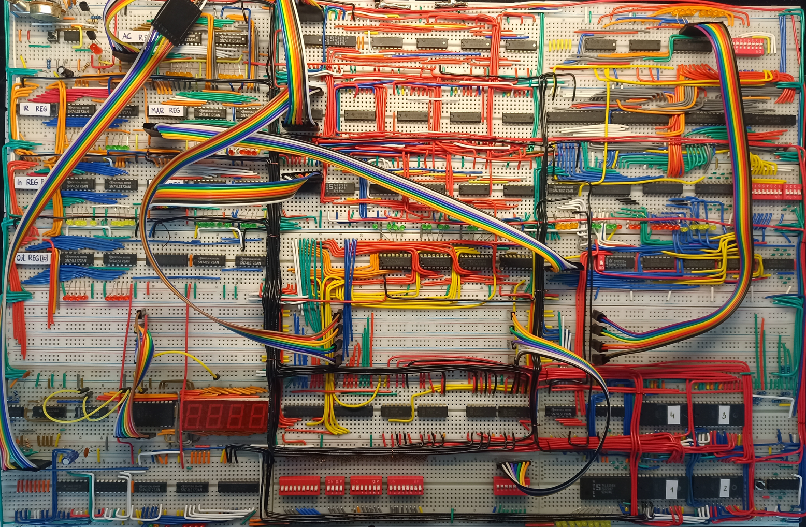

# NAT-8C1: 8bit computer

> ⚠️ **Warning**: This project is currently under development. It has not yet been fully verified and may be incomplete or unstable.
> Stay tuned for updates.

## Overview
NAT-8C1 (NATALIE CPU 8bit CISC 1) is an single-core, 8-bit, in-order, non-pipelined, non-hyperthreaded, CISC, ACU-based CPU. This is a basic
implementation derived from a of modified **MARIE CPU**. This simple computer described in `The Essentials of Computer Organization and Architecture`,
a book written by Linda Null and Julia Lobur. The project was developed for educational purposes.

    

        
    

# Documentation
List of available documents:
- [Hardware Architecture Spec](doc/hw-arch-spec.md)
