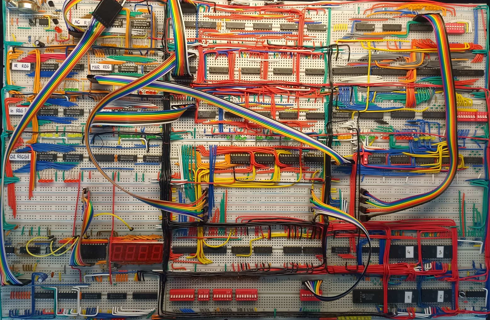

# NAT-8C1: CISC CPU

> ⚠️ **Warning**: This project is currently under development. It has not yet been fully verified and may be incomplete or unstable.
> Stay tuned for updates.

## Overview
NAT-8C1 (NATALIE CPU 8bit CISC 1) is an single-core, 8-bit, in-order, non-pipelined, non-hyperthreaded, CISC, ACU-based CPU. This is a basic
implementation derived from a of modified **MARIE CPU**. This simple computer described in `The Essentials of Computer Organization and Architecture`,
a book written by Linda Null and Julia Lobur. The project was developed for educational purposes.

    

        
    

# Documentation
List of available documents:
- [Hardware Architecture Spec](doc/hw-arch-spec.md)
- [Instruction Set Spec](doc/isa-spec.md)

## Schematics

Currently, the project is in the process of migrating from **Eagle**, which is no longer available for free for
non-commercial use, to **KiCad** (an open-source PCB design and electronics CAD software).
The following files should be tracked in the repository for the new CAD software:

| Extension / File | Purpose | Tracked in Git? |
| :--- | :--- | :---: |
| `*.kicad_sch` | **Schematic Sheet** — Main schematic drawing containing components, wires, labels, and net connections. | **Yes** |
| `*.kicad_pro` | **Project File** — Project settings, ERC parameters, and schematic configurations. | **Yes** |
| `sym-lib-table` | **Symbol Library Table** — Maps project-level library nicknames to symbol file paths. | **Yes** |
| `*.kicad_sym` | **Symbol Library** — Component symbol definitions (located in `design/lib/eagle-import/`). | **Yes** |
| `*.kicad_prl` | **Local Runtime Settings** — User-specific GUI state (window positions, zoom levels, open tabs). Auto-generated per user. | ❌ **No** |
| `*.lck`, `~*.lck` | **Lock Files** — Created by KiCad when a project is open to prevent concurrent writes. | ❌ **No** |
| `_autosave-*`, `*-backups/` | **Autosaves & Backups** — Temporary recovery files and auto-backup folders. | ❌ **No** |
| `.history/` | **Editor Local History** — Local IDE snapshot directory. | ❌ **No** |
