# Hardware Architecture Spec
## 1. Overview
The purpose of this document is to describe the hardware architecture of the presented solution.
This 8-bit CPU was designed based on the high-level architecture of the 16-bit MARIE (Machine
Architecture that is Really Intuitive and Easy) computer, as described in “The Essentials of Computer
Organization and Architecture” by L. M. Null and J. M. Lobur, with several architectural modifications applied.
The project was created for educational purposes.

## 2. Clock
The main clock is implemented using the popular 555 timer, originally designed by Hans Camenzind in 1971.
For this project, the widely used NE555 integrated circuit, originally manufactured by Signetics, was selected.
However, it can be easily replaced by compatible alternatives, such as the LM555 introduced by Texas Instruments.
Relevant documentation:
- NE555: https://www.ti.com/lit/ds/symlink/ne555.pdf
- LM555: https://www.ti.com/lit/ds/symlink/lm555.pdf

Additional background information can be found on the [wiki page](https://en.wikipedia.org/wiki/555_timer_IC)

### 2.1 Continous mode
In this design, the NE555 operates in **astable mode**, which generates a continuous stream of digital pulses
with a configurable period. This configuration is achieved by connecting the `THR` (threshold) and `TRIG` (trigger)
pins and supplying them through a network consisting of a potentiometer (R2), resistors (R1 and R3), and a capacitor
(C2). Resistor **R3** is included to define the minimum resistance value, preventing excessive current when the
potentiometer R2 is set to 0 Ω. This is particularly important for bipolar timers to ensure proper output saturation
near 0 V during capacitor discharge. Due to this configuration, the voltage on the `TRIG` and `THR` pins remains identical
(see the `note` below). The duty cycle depends on:
- the resistance of the potentiometer (R2),
- resistors R1 and R3,
- the capacitance of C2.

The operating principle is straightforward: the capacitor voltage controls the internal SR latch of the timer.
- When the capacitor discharges below **1/3 Vcc**, the output (`Q`) switches to logic high.
- When the capacitor charges above **2/3 Vcc**, the output switches to logic low.

The idea is simple, capacitor voltage triggers internal latch to change the state. From "1"
to "0" during the time of capacitor discharge (C2) and from "0" to "1" during capacitor charge. Time of
charging/discharging of capacitor depends on its capacity (expressed in farads), resistance of potentiometr (R2)
and resistors (R3 and R1 - expressed in ohms). The higher resistence the slower charging/discharging process because
capacitor have to pull (through the R2, R3, R1) / push (through the R2, R3) current. Same in terms of capacity,
the higher value of capacity the longer time needed to charge and discharge it. In that terms the potentiometr
(R2) was added to be able to easy change the frequency of the clocking signal that appears on pin `Q` (clock).
The exact schema of described connections was added below:

<div>
    <p align="center" width="100%">
        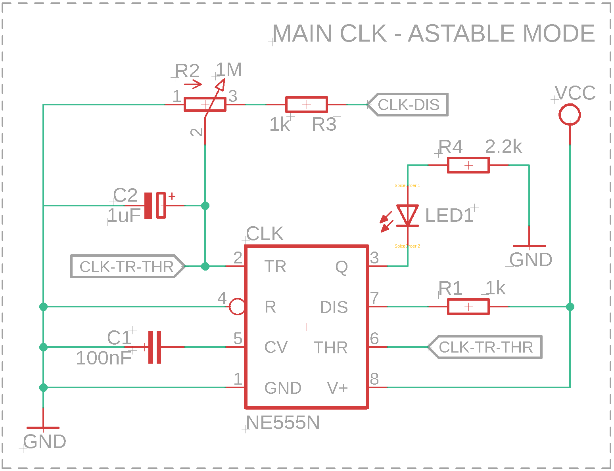
    </p>
    <p align="center">
        <i>Figure 2.1.1: main clock circuit</i>
    </p>
</div>

> __Note__:
>
> When the voltage on the `TRIG` pin drops below **1/3 Vcc**, the internal latch sets the output `Q` to logic high,
> and capacitor `C2` begins charging through `R1`, `R2`, and `R3`.
> Once the voltage on the THR pin reaches **2/3 Vcc**, the latch resets the output `Q` to logic low, and the capacitor
> discharges through `R2` and `R3`.
> Therefore, maintaining the same voltage on both `TRIG` and `THR` pins is essential.
> Oscilloscope measurements were taken with Vcc = 5 V and R2 set to 0 Ω:
> - channel 1 (yellow) capacitor (C2) voltage oscillating between 1/3 Vcc and 2/3 Vcc
> - channel 2 (pink) clock output (Q)
>
> <p align="center" width="100%">
>     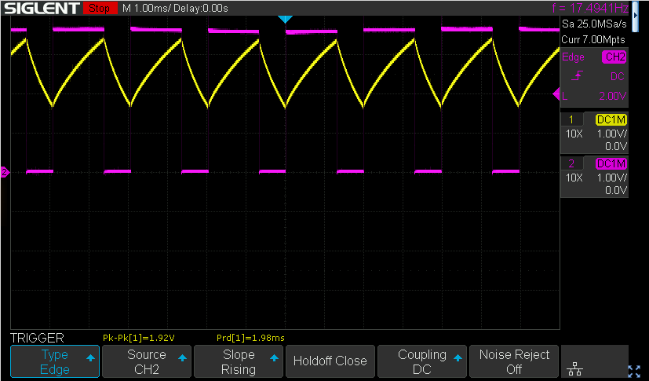
> </p>
> <p align="center">
>    <i>Figure 2.1.2: main clock pulse generation</i>
> </p>


The pulse durations are defined as:

```math
t_h =  ln(2) * (R1 + R2 + R3) * C2
```
```math
t_l =  ln(2) * (R2 + R3) * C2
```

The resulting frequency is:

```math
f = \frac{1}{t_h +t_l} = \frac{1}{ln(2) * (R1 + 2(R2 + R3)) * C2}
```

The duty cycle is:

```math
D = \frac{t_h}{t_h +t_l} * 100 = \frac{R1 + R2 + R3}{R1 + 2(R2 + R3)} * 100
```

### 2.2 Stepping mode
The stepping mode is intended for debugging purposes. It enables the generation of a single clock pulse,
allowing step-by-step execution of CPU instructions. A simple push-button connected between Vcc and GND
can generate a pulse; however, mechanical switch bouncing may cause multiple unintended pulses, as shown
in Figure 2.2.1.

<div>
    <p align="center" width="100%">
        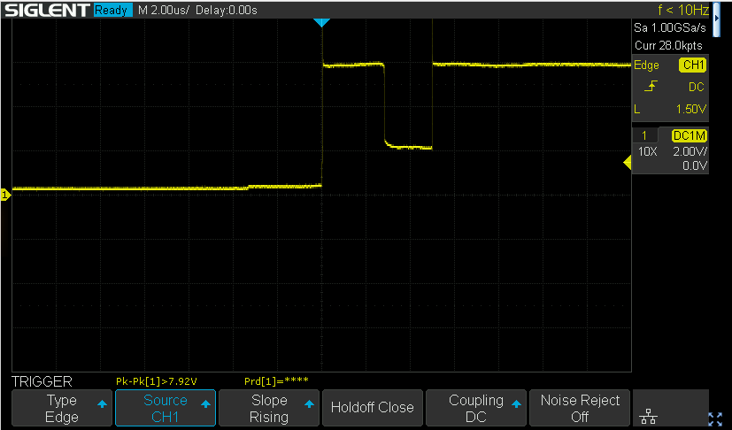
    </p>
    <p align="center">
        <i>Figure 2.2.1 debug button bouncing issue</i>
    </p>
</div>


Switch bouncing is a well-known issue and can be mitigated using Schmitt triggers, flip-flops, counters, or debouncing circuits.
In this design, the NE555 timer in monostable mode is used for debouncing. The NE555 contains an internal SR latch, which
effectively suppresses bounce-induced noise. An LTspice simulation model was created to demonstrate this behavior.
(clock/ltspice/ne555n-monostable-debouncing):

<div>
    <p align="center" width="100%">
        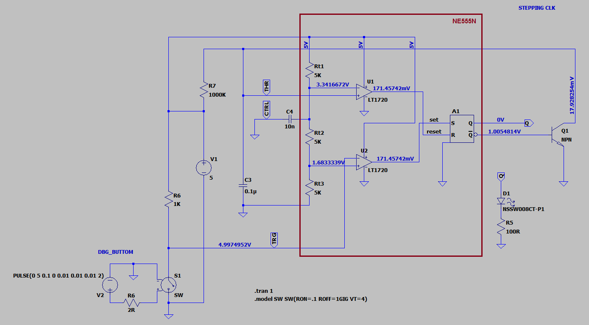
    </p>
    <p align="center">
        <i>Figure 2.2.2: schema of timer555 in monostable mode (ltspice simulator)</i>
    </p>
</div>

In monostable mode, the NE555 generates a single output pulse when the TRIG signal falls below 1/3 Vcc. The pulse duration depends
on the charging time of capacitor C3:

```math
t = ln(3) * R7 * C3
```

Additional circuit with voltage controlled switch at the bottom left corrner was added to simulate switch bouncing
issue. Simulation results confirm that even with a bouncing trigger signal, only one clean output pulse is generated.

<div>
    <p align="center" width="100%">
        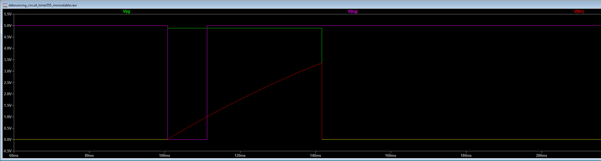
    </p>
    <p align="center">
        <i>Figure 2.2.3: ltspice simulation results for timer 555 in monostable mode - common case</i>
    </p>
</div>

Where output pulse V(q) (marked green) was intentionally lowered to 4.9V to increase readability of the chart.
V(thr) (marked red) shows C3 charging process through the resistor R7, and then immediate drop after it
reach 2/3 Vcc limit. Drop goes immediate because there is no resistior plugged between discharging transistor (Q1)
and GND. The last signal V(trg) (marked pink) shows trigger signal. The most important is the fact that even if
situation showed at the beging of the section (Figure 2.2.1) happens the circuit still works and only single
pulse will be generated:


<div>
    <p align="center" width="100%">
        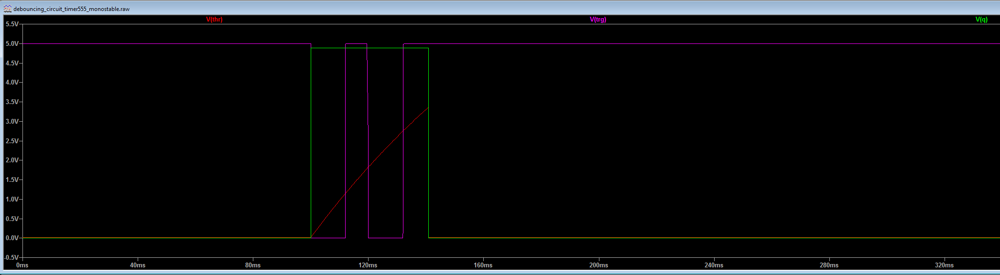
    </p>
    <p align="center">
        <i>Figure 2.2.4: ltspice simulation results for timer 555 in monostable mode - bouncing trigger</i>
    </p>
</div>


The complete debouncing circuit for stepping mode is shown in Figure 2.2.5.

<div>
    <p align="center" width="100%">
        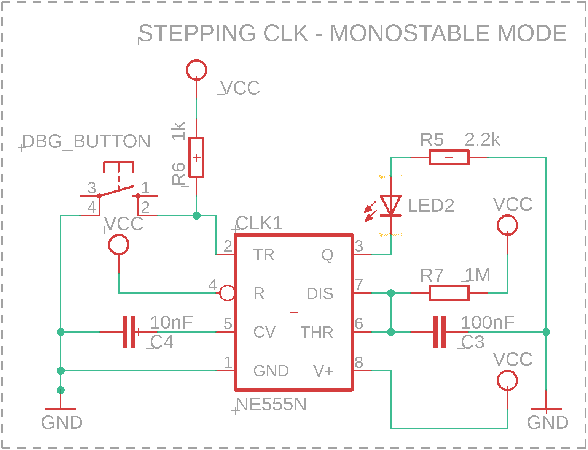
    </p>
    <p align="center">
        <i>Figure 2.2.5: stepping clock circuit</i>
    </p>
</div>

### 2.3 Combined Clock Circuit
Using:
 - NE555 in **astable mode** for continuous operation (figure 2.1.1),
 - NE555 in **monostable mode** for single-step debugging (figure 2.2.5),

a unified clock circuit was constructed.

On the one hand **astable mode** will be used as an operational mode of the clock
to continously generate digital clocking signal, on the other hand **astable mode** will be used as a debug mode
of the clock to generate single clocking signal trigger by debounced pushed button (NE555 chip resposibility in this
configuration is limited to debounce the signal produced by button push).

Unlike more complex designs (e.g., [Ben Eater’s clock module]((https://eater.net/8bit/clock)) using three NE555 timers),
this project employs a simpler approach using:
- one NE555 timer,
- one SPDT switch,
- a PNP bipolar transistor,
- an N-channel MOSFET.
This approach reduces component count while retaining full functionality and serves educational purposes by demonstrating
differences between bipolar PNP and MOSFET transistors.

<div>
    <p align="center" width="100%">
        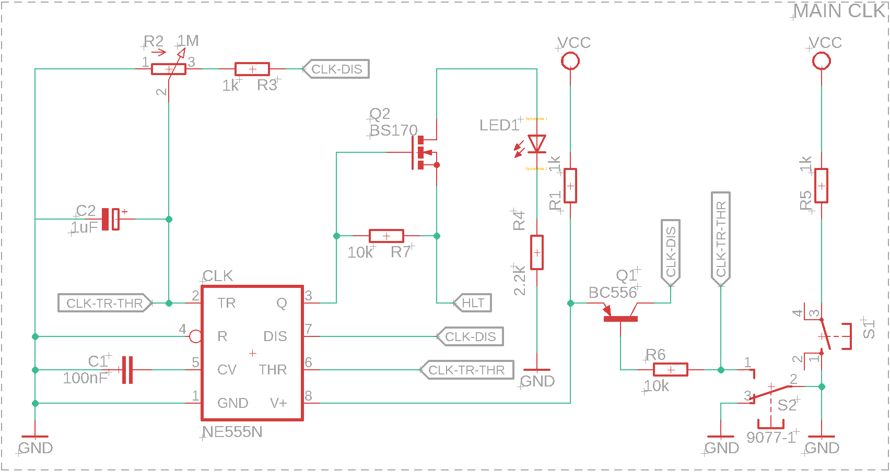
    </p>
    <p align="center">
        <i>Figure 2.2.6: clock circuit</i>
    </p>
</div>

To be able to switch between two different modes (astable and monostable) we need to be able to close and open
internal connection between pins `TR` (trigger), `THR` (treshold) and pin `DIS` (discharge). After disconnecting
`DIS` pin for monostable mode of NE555 we need to provide alternative way to discharge capacitor C2, which is implemented
by path on the right hand site. SPDT switch (S2) on the one hand is responsible for connecting/disconnecting this
alternative path with regular circuit and on the other hand for bipolar PNP transistor BC556 (Q1) control. When:

- switch S2 is opened (pin 2 and 3 of the switch are connected) **base** pin of the transistor is grounded. That means
there is no current between **base** and **emiter**, and as a result **collector**-**emiter** path is opened.
It gives an oportunity to discharge the C2 capacitor over the `DIS` pin, which starts the oscillation described at the
beginning of the section - astable mode of the NE555.
- switch S2 is closed (pin 2 and 1 of the switch are connected) current flows over the **base** pin to the **emitter**
which causes the other connection between **collector** and **emiter** to close. It prevents from discharing capacitor
C2 over the `DIS` pin, at the same time it opens the alternative way to discharge it by pushing SPST (Single Pole Single
Throw) button (S1). When the button is pushed it will ground line between `TR` (trigger) and `THR` (treshold), which will
cause capacitor C2 to discharge. Voltage will be dropped bellow 1/3 of the Vcc and as a result clock signal at pin `Q` rise
(high state - 1). After the button release line will be connected back to the Vcc source, capacitor C2 will start charging,
voltage at line between pins `TR` and `THR` will rise above 2/3 of the Vcc and as a result pin `Q` will return to the default
(low state - 0) - monostable mode of the NE555.

In this case both SPDT switch (S2) and SPST debug button (S1) are debounced by internal SR latch of NE555 timer in monostable
mode. The second switch (S2) connectors bounce affects connection between `DIS` pin of NE555 and capacitor C2 as you can see
bellow, where yellow line represents the output from the line connected to the capacitor C2, and pink line represents digital
signal from the output of NE555 timer (pin `Q`):

<div>
    <p align="center" width="100%">
        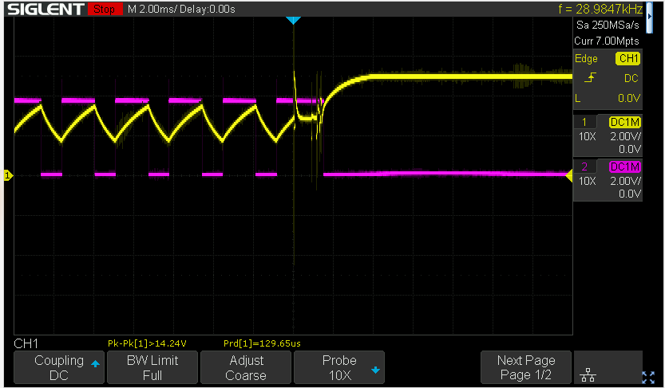
    </p>
    <p align="center">
        <i>Figure 2.2.7: SPDT switch (S2) off-on debouncing (1/2)</i>
    </p>
</div>

<div>
    <p align="center" width="100%">
        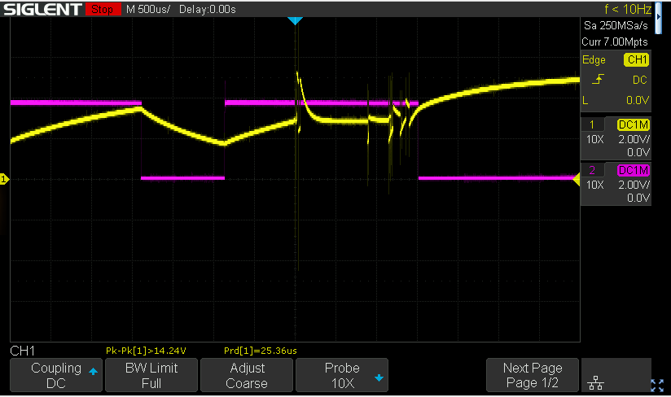
    </p>
    <p align="center">
        <i>Figure 2.2.8: SPDT switch (S2) off-on debouncing (2/2)</i>
    </p>
</div>

<div>
    <p align="center" width="100%">
        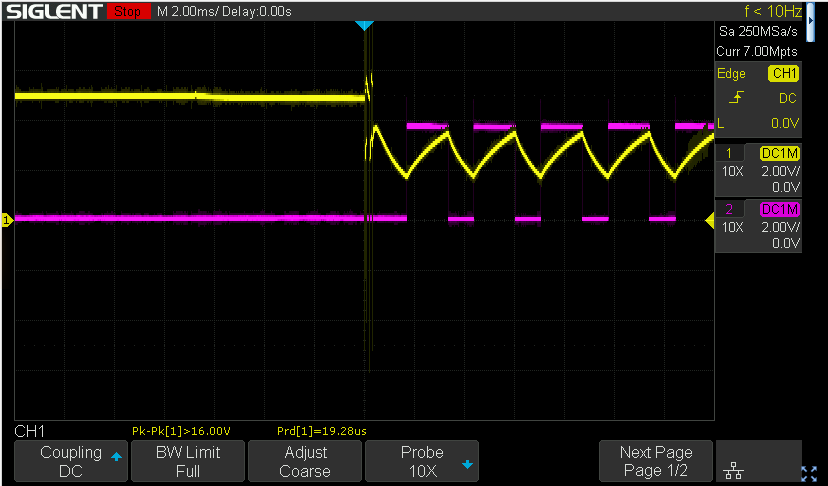
    </p>
    <p align="center">
        <i>Figure 2.2.9: SPDT switch (S2) on-off debouncing (1/2)</i>
    </p>
</div>

<div>
    <p align="center" width="100%">
        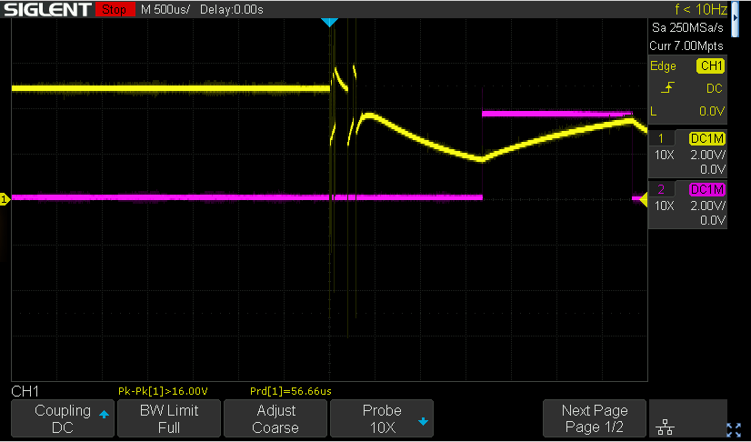
    </p>
    <p align="center">
        <i>Figure 2.2.10: SPDT switch (S2) on-off debouncing (2/2)</i>
    </p>
</div>

<div>
    <p align="center" width="100%">
        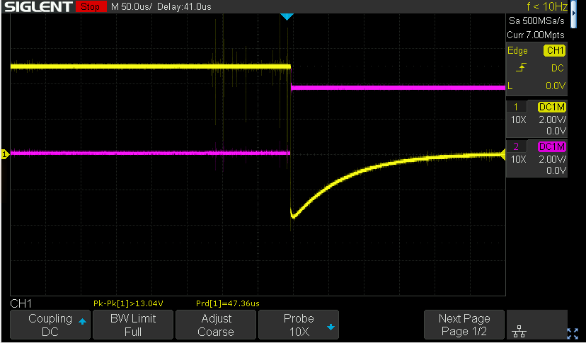
    </p>
    <p align="center">
        <i>Figure 2.2.11: SPST debug button (S1) off-on debouncing (1/2)</i>
    </p>
</div>

Notice that additional transistor was added to the output of the circuit (pin `Q`). This transistor was added to enable `HLT`
(HALT) signal, similar to the logic circuit added to the clock module presented by Ben Eater. Unipolar MOSFET N-channel
transistor (BS170) is controlled by voltage (instead of current - as it was done for bipolar PNP transistor BC556). When
the HLT line is grounted connection between the **source** and **drain** is opened, and the digital signal that goes to
the **gate** will be propageted the **drain** pin. However when the voltage on the **source** pin go high (around
Vcc value) the connection between **gate** and **drain** will be closed, and digital signal won't be propageted to the
**drain**. That saying:
- when `HLT = 0`, the clock signal propagates normally.
- when `HLT = 1`, the clock output is suppressed, effectively halting the CPU.

## 3. ALU (Arthmetic Logic Unit)

The ALU could be implemented using the classic TTL **74\*181**, but this project follows the simplified ALU architecture
presented in “The Essentials of Computer Organization and Architecture” (Section 3.6).

The original design supports:
- one arithmetic operation (addition without carry),
- three logic operations (AND, OR, NOT).

This design was extended to support:
- subtraction,
- carry handling.

<div>
    <p align="center" width="100%">
        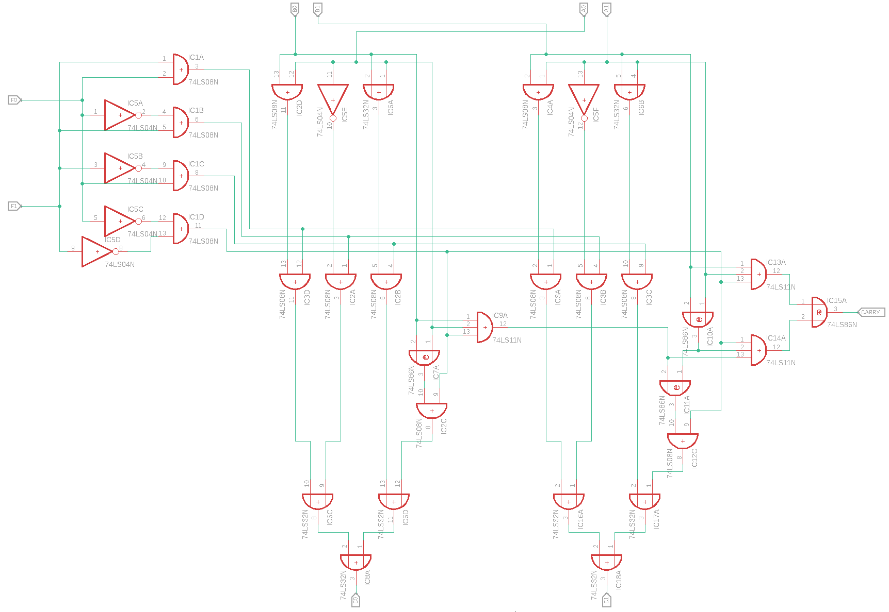
    </p>
    <p align="center">
        <i>Figure 3.1: 2-bit ALU unit, source: "The Essentials of Computer Organization and Architecture" </i>
    </p>
</div>

On the schema we can recognize few circuits:
- decoder, which in fact is a part of MUX (multiplexer), however to limit number of gates decoder was shared between two multiplexers. Each
  MUX is responsible for performing operation on two following bits of two input values.
- half adder, which can add two bits without carry, described in details by [article](https://en.wikipedia.org/wiki/Adder_(electronics)#Half_adder)
- full adder, which can perform the same operation but with carry, described in [article](https://en.wikipedia.org/wiki/Adder_(electronics)#Full_adder),
- some basic logic gates AND, OR, NOT (inverter) to perform basic logic bitwise operations


<div>
    <p align="center" width="100%">
        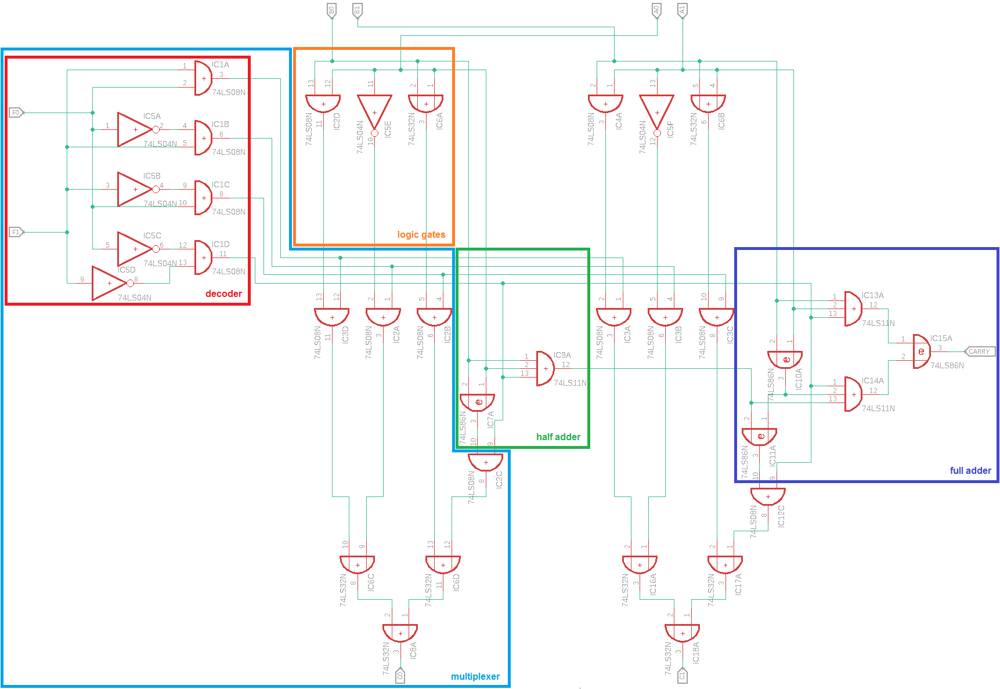
    </p>
    <p align="center">
        <i>Figure 3.2: sections of 2-bit ALU unit</i>
    </p>
</div>

ALU use internal multiplexer to select (based on combination of decoder input signal F0, F1 values: b'00 [0], b'01 [1], b'10 [2], b'11 [3])
one of the four lines that provides result of logical or arthmetic operation:
- AND gate output: provides result of logical conjuction of two bits {A0; B0}, {A1; B1}
- OR gate output: provides result of logical disjunction of two bits {A0; B0}, {A1; B1}
- NOT (inverter) gate output: provides logical negation for the first number bits: A0, A1
- half/full adder circuit output: provides result of arthmetic sum of two bits {A0; B0}, {A1; B1; carry from pervious sum}

To build the prototype of ALU circuit we can use following TTL chips:
- Dual 4-line to 1-line data Multiplexer (74\*153),
- 4-bit full adder circuit (74\*283),
- logic gates: quad 2-input AND gate (74\*08), quad 2-input OR gate (74\*32), hex inverter (74\*04)

To support subtraction, [two's complement arithmetic](https://en.wikipedia.org/wiki/Two's_complement) is used:
- bits are inverted using XOR (Exclusive OR) gates,
- a carry-in of 1 is added via a full adder.

Such representation allows to avoid some basic issues like double representation of number "0", or additional circuit to establish the correct
sign bit for calculated result. The final 8-bit ALU implementation uses six TTL chips and is shown in Figure 3.3.

<div>
    <p align="center" width="100%">
        
    </p>
    <p align="center">
        <i>Figure 3.3: 8-bit ALU unit</i>
    </p>
</div>

## 4. Registers

Registers are utilize by ALU unit for computations, to store temporary values and operation results. Each register is build based on D-type
flip-flops connected in sequence. Single register is 8 bits width, and was implemented with two 74\*74 TTL chips connected together. NAT-8C1
has the same set of registers as original architecture of MARIE, however some of the internal connections were modified. Following registers
are present:
- **ACU** - Acumulator, general purpose register, stores value to be processed by ALU, holds result of the performed operation.
- **MAR** - Memory Address Register, stores lower part of the memory address (RAM).
- **MBR** - Memory Buffer Register, stores value read from memory, or value to be written into memory. It's connected to the ALU, and
  together with **ACU** are used for computions.
- **PC** - Program Counter, contains memory address of the next instruction to be processed by ALU. It can jump to the memory address
  pointed by **MAR** register, first bit of **IR** and special purpose register **PAR** (Page Address Register). Based on the content
  of these registers poper value of the memory address is calculated. This register is created based on JK flip-flops (74\*76), contrary
  to the rest of the registers created based on D-type flip-flops. Due to different and more complex internal design of the register it
  was described in details in separate section (see [Program Counter](5.-Program-Counter)).
- **IR** - Instruction Register, It stores opcode (operational code) of the instruction to be processed by ALU. It's splitted into
  lower part of 4 bits, which contains optional instruction data, and higher part of 4 bits which contains instruction code. It gives
  possibility to define 16 possible instructions described in a separate section (see [ISA](10.-Instruction-Set-Architecture)).
- **IO[0-3]** - Input/Output Registers, four registers used to connect external devices/controlers to the CPU.

<div>
    <p align="center" width="100%">
        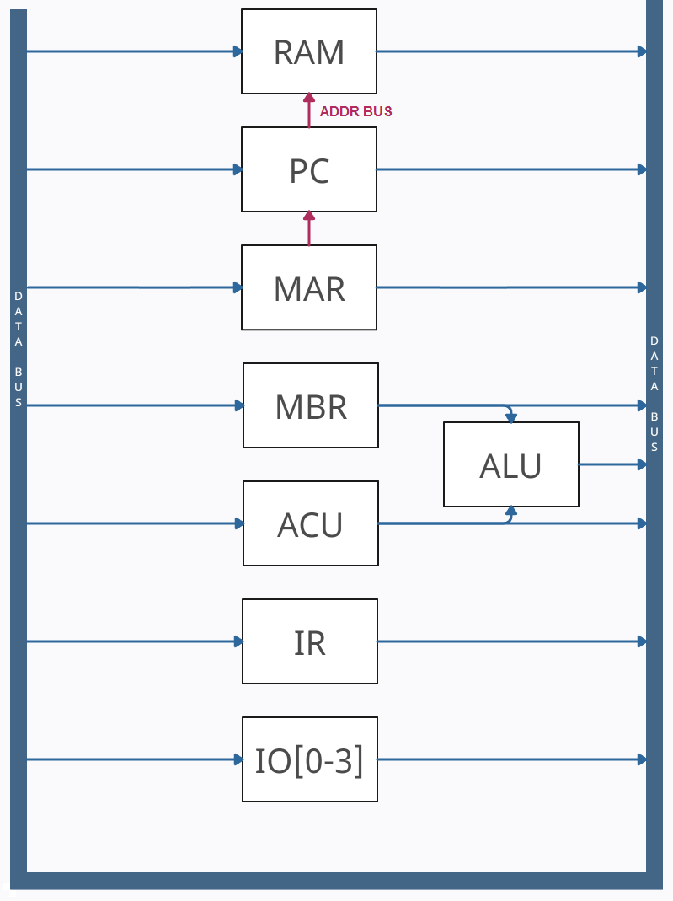
    </p>
    <p align="center">
        <i>Figure 4.1: Registers - overview</i>
    </p>
</div>

Current state of the CPU is kept by special purpose register FLAG. All registers are plugged into **data bus**, used for data exchange
between them and memory.

<div>
    <p align="center" width="100%">
        
    </p>
    <p align="center">
        <i>Figure 4.2: Registers - exact schema</i>
    </p>
</div>

## 5. Program Counter

Program counter is reponsible for iterating through the addresses of RAM and make possible for the CPU to load consecutive instructions
from there and execute them. It's implemented using different, more complex way based on synchronous JK flip-flops binary counters
connected in sequence. Single chip `74*161` has four JK flip-flops connected together. All JK flip-flopps are clocked simultaneously,
to eliminated the output counting spikes, which are normally associated with asynchronous counters. Due to `RCO` (ripple carry output)
it is possible to cascading several chips together. This application has four chips connected together to be able to address memory (13
address lines in total). It's also possible to load starting address via `A-D` pins and `LD` (load) signal, which is crucial for all
branch instructions exposed as a part of CPU ISA.

<div>
    <p align="center" width="100%">
        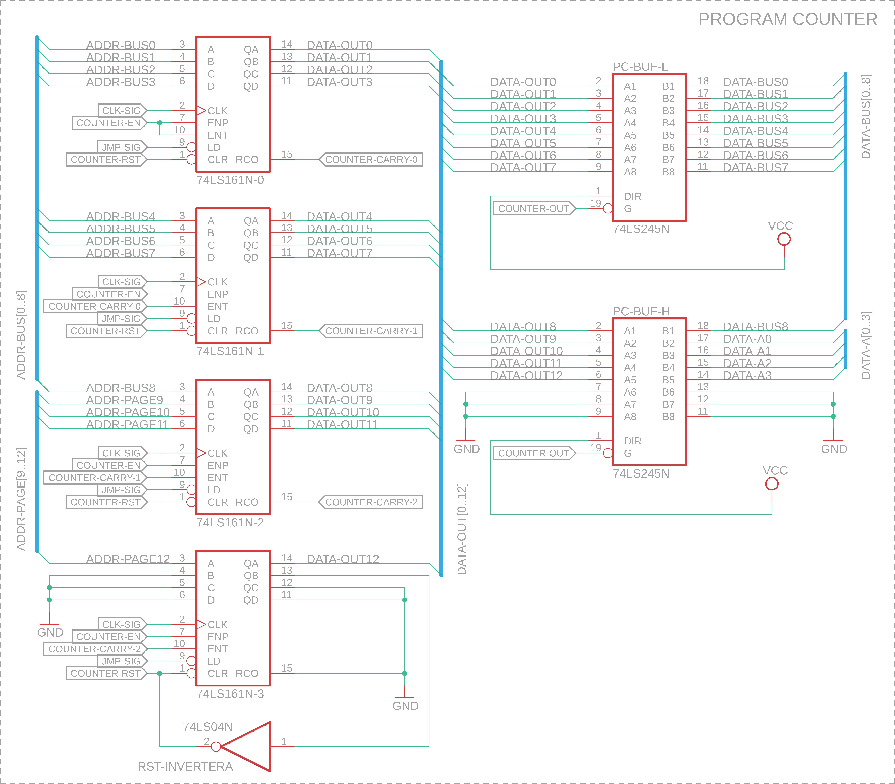
    </p>
    <p align="center">
        <i>Figure 5.1: Program Counter - exact schema</i>
    </p>
</div>

In our application due to limitted size of `MAR` register only first 8 bits out of 13 can be loaded directly from there to the `PC`.
Bit number 9 is loaded from the very first bit of `IR` register, and the rest of the address is taken from 4bit width `PAR` register.
As a result to load a new address for jump instruction we need to split the address value and load it into three separate registers.

## 6. Special Purpose Registers
TBD
- **PAR** - Page Address Register
- **FLAG** - CPU Status Register

## 7. RAM (Random Access Memory)

NAT-8C1 has single memory chip. Both data to process and instructions to perform in form of program compiled to the machine code
are stored there. In general to build the main memory module one of the following type of chips can be used:
- DRAM (Dynamic Random Access Memory) - due to internal desing, where each bit of information is represented by state of internal
  capacitor (charged state coresponds to high state of bit - "1", discharged state coresponds to low state of bit - "0")
  and related charging/discharging transitor, these type of memory is usually cheaper than SRAM, and due to different approach of
  cells addressing it has reduced number of address pins (twice). However to keep the state of memory permanent over the time of
  execution it requires a specialized circuit for cell states refresh, which makes the whole memory module more complex comparing
  with modules based on SRAM chips.
- SRAM (Static Random Access Memory) - this type of chip is built based on D-type flip flops, same as shift registers. As a result
  the state of the bit is stored by inverting feedback on the circuit's gates. Memory itself is more complex then DRAM and as result
  more expensive, however it doesn't need any additional circuit for memory cells refresh (due to lack of capacitors).

This solution uses SRAM. There are plenty of chips that can be used for the final memory module implementation. In general these
chips contains:
- memory cell array to keep instruction and data to process,
- address decoder splitted into two parts, for rows and for columns where proper address lines are connected.

Size of the memory cells may be different, however the common size is set to 8 bits. Each memory cell can be build based on
few sequentialy connected D-type flip-flops, same as for shift registers. Chip 74\*74 provides dual D-type flip flops circuit,
however due to a huge number od chips needed to build memory cell array with resonable size for this application we will use large
scale memory chip [KM6264BLS-10L](https://www.datasheets360.com/pdf/-2077603173809567344) which is 8Kx8-bit high-speed Static RAM
organized as 8, 192 words by 8 bits. It's a CMOS chip with TTL compatible inputs and outputs, JEDEC Standard pin configuration and
three state output. Functional block diagram was presented below:

<div>
    <p align="center" width="100%">
        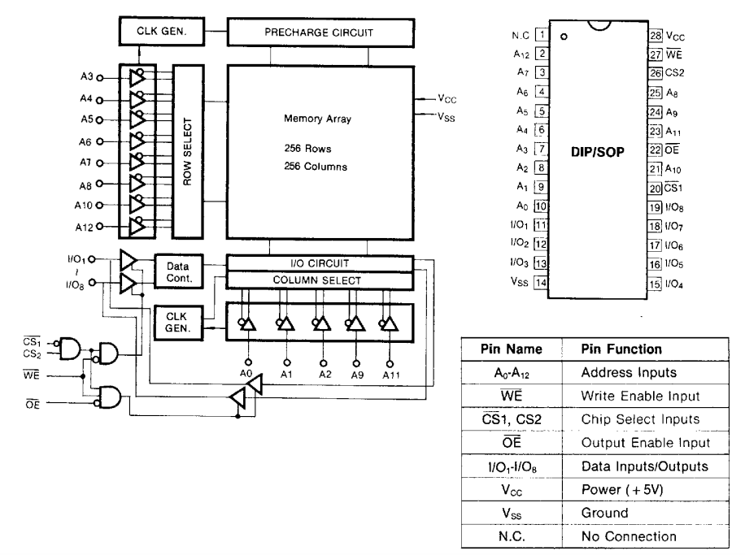
    </p>
    <p align="center">
        <i>Figure 7.1: SRAM 8Kx8bit module KM6264BLS-10L functional block diagram, source: "KM6264BBL/KM6264BL-L datasheet"</i>
    </p>
</div>

The maximum size of address bus used for this project was reduced to 11 lines. The only reason for that is to try to reduce the
number of wires needed to construct the memory bus. On the other hand we still would like to be able to address a resonable size of memory.
Like for instance 32KB, which is the minimum size of the RAM needed to run the early Operating System like
[ISIS](https://en.wikipedia.org/wiki/ISIS_(operating_system)) (Intel Systems Implementation Supervisor) or [CP/M](https://en.wikipedia.org/wiki/CP/M)
(Control Program/Monitor). To make it possible a simple [memory paging](https://en.wikipedia.org/wiki/Memory_paging) mechanism was
added to the module. The mechanism allows to retrieve data from storage in same-size blocks called pages. At the specific moment
of code execution CPU sees only one page of memory pointed by value of [PAR](https://en.wikipedia.org/wiki/Page_address_register)
(Page Address Register). The last two address lines (`ADDR-BUS9` and `ADDR-BUS10`) are connected to the input of
[demultiplexer](https://en.wikipedia.org/wiki/Multiplexer#Digital_demultiplexers) (DEMUX), the output of DEMUX is connected to the `CS1`
(Chip Select) input of the memory chip, which makes accessible only one memory chip (out of four) during the code execution.
`PAR` is 4-bits size shift register built on D-Type Flip-Flops, for this application TTL chip 74\*173 was used.
As a memory four **KM6264BKS-10L** chips were used which gives us 4 blocks of 8KB, 32KB of memory in total devided into 2^4 (maximum
value kept by `PAR`) * 4 (number of memory chips) = 64 pages (each page of 512B). The last thing is the capability to switch memory
module between two modes:
- running mode - code execution mode,
- program mode - code load mode.

The switch was done by quadruple 2-line to 1-line data selectors: TTL 74\*157 chips. The whole schema of the memory module was presented
below:

<div>
    <p align="center" width="100%">
        
    </p>
    <p align="center">
        <i>Figure 7.2: Full RAM module schema</i>
    </p>
</div>

## 8. ROM
TBD

## 9. Control Unit
TBD

## 10. Instruction Set Architecture
TBD